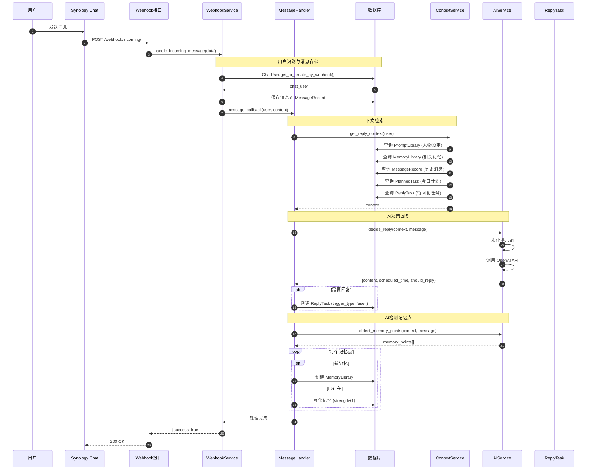
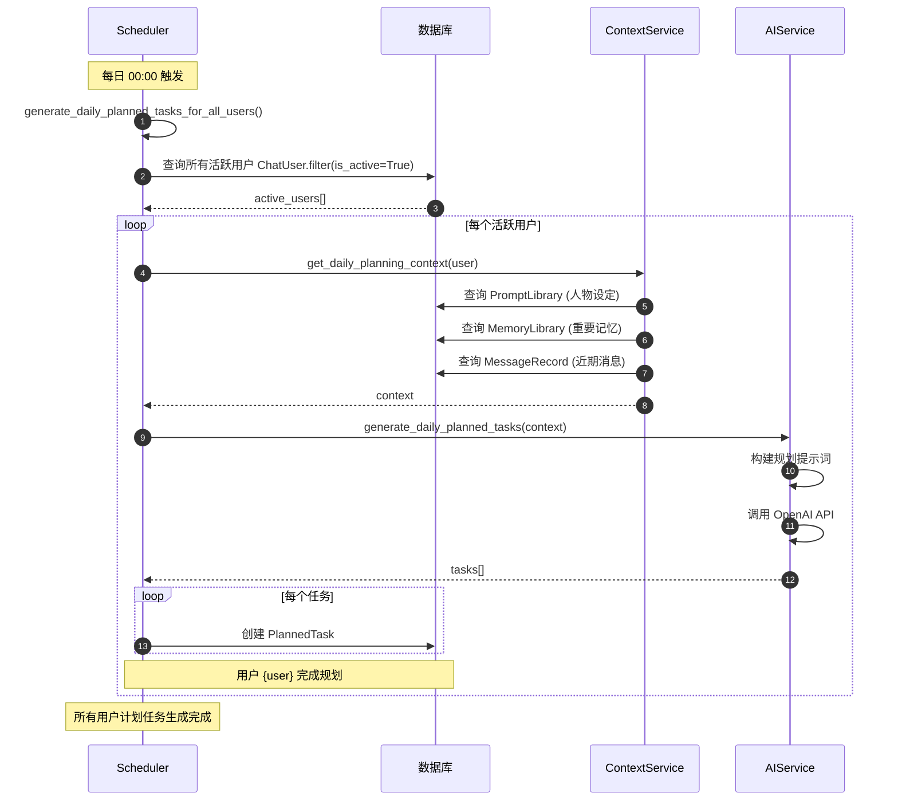
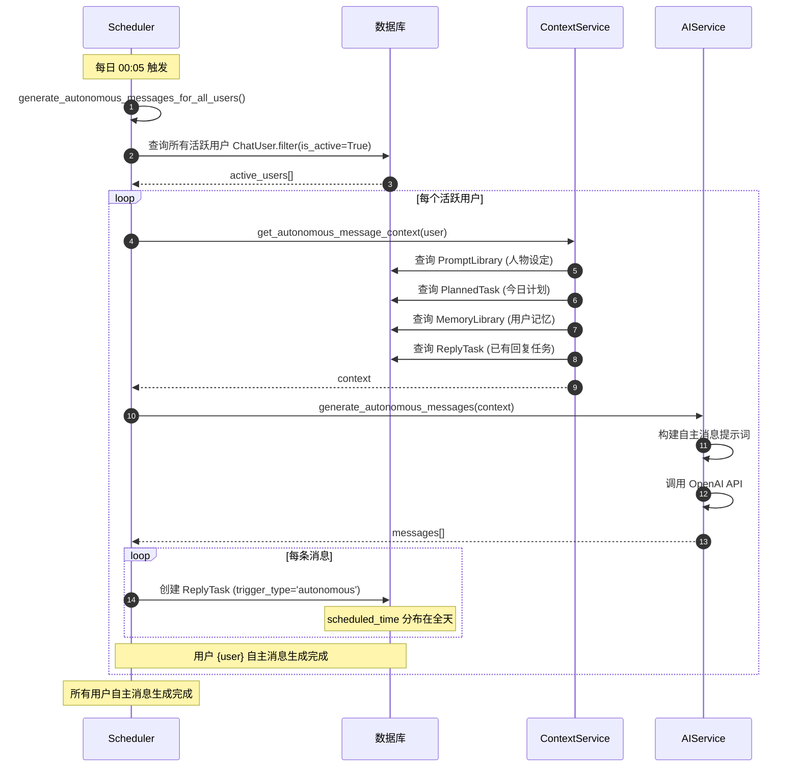
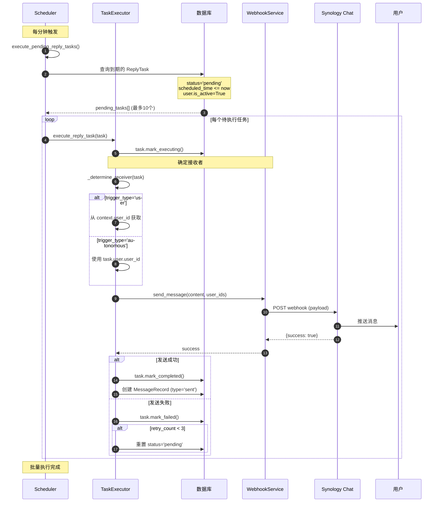
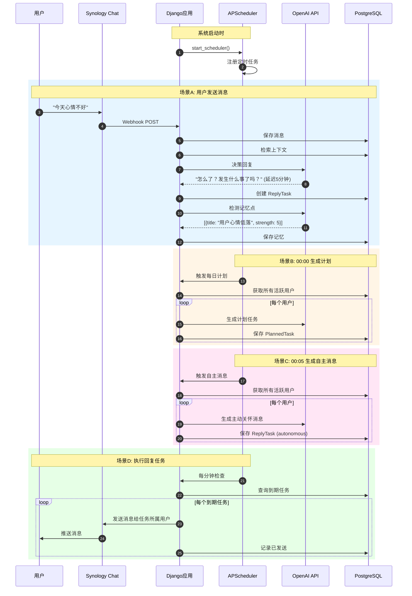
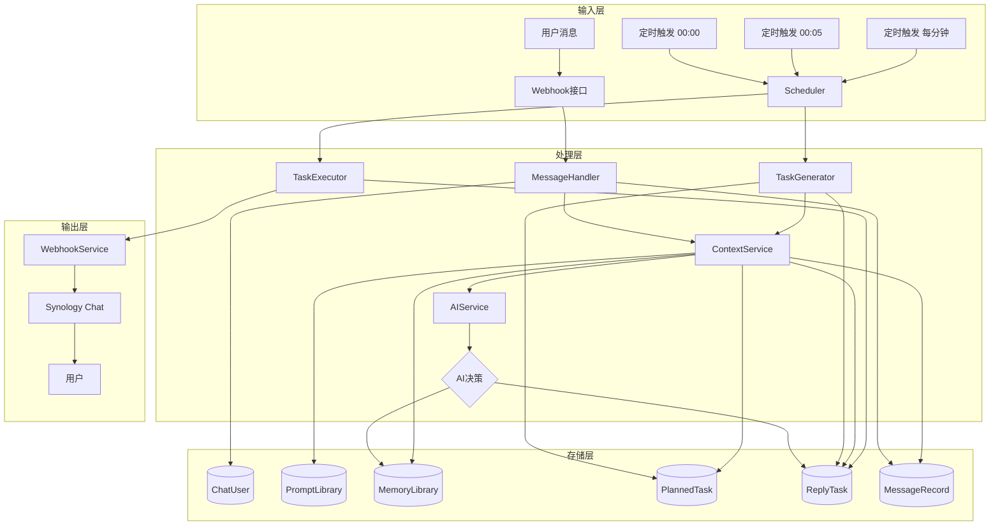
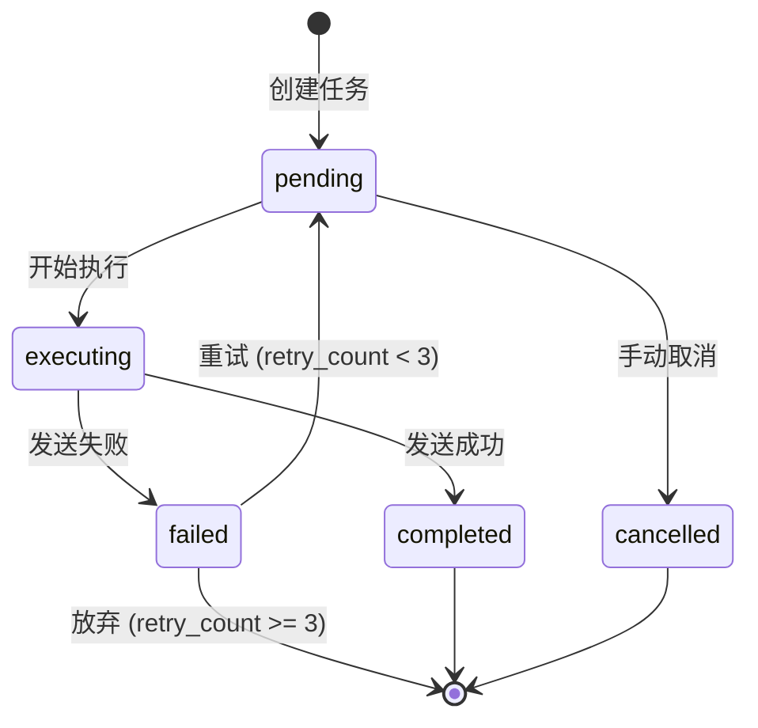
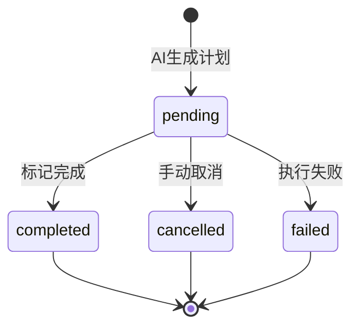

# RuoChat2 系统时序图

## 一、用户消息处理流程

```mermaid
sequenceDiagram
    autonumber
    participant User as 用户
    participant SC as Synology Chat
    participant WH as Webhook接口
    participant WS as WebhookService
    participant MH as MessageHandler
    participant DB as 数据库
    participant CS as ContextService
    participant AI as AIService
    participant RT as ReplyTask

    User->>SC: 发送消息
    SC->>WH: POST /webhook/incoming/
    WH->>WS: handle_incoming_message(data)

    Note over WS,DB: 用户识别与消息存储
    WS->>DB: ChatUser.get_or_create_by_webhook()
    DB-->>WS: chat_user
    WS->>DB: 保存消息到 MessageRecord

    WS->>MH: message_callback(user, content)

    Note over MH,CS: 上下文检索
    MH->>CS: get_reply_context(user)
    CS->>DB: 查询 PromptLibrary (人物设定)
    CS->>DB: 查询 MemoryLibrary (相关记忆)
    CS->>DB: 查询 MessageRecord (历史消息)
    CS->>DB: 查询 PlannedTask (今日计划)
    CS->>DB: 查询 ReplyTask (待回复任务)
    CS-->>MH: context

    Note over MH,AI: AI决策回复
    MH->>AI: decide_reply(context, message)
    AI->>AI: 构建提示词
    AI->>AI: 调用 OpenAI API
    AI-->>MH: {content, scheduled_time, should_reply}

    alt 需要回复
        MH->>DB: 创建 ReplyTask (trigger_type='user')
    end

    Note over MH,AI: AI检测记忆点
    MH->>AI: detect_memory_points(context, message)
    AI-->>MH: memory_points[]

    loop 每个记忆点
        alt 新记忆
            MH->>DB: 创建 MemoryLibrary
        else 已存在
            MH->>DB: 强化记忆 (strength+1)
        end
    end

    MH-->>WS: 处理完成
    WS-->>WH: {success: true}
    WH-->>SC: 200 OK
```

## 二、每日计划任务生成流程 (00:00)

```mermaid
sequenceDiagram
    autonumber
    participant SCH as Scheduler
    participant DB as 数据库
    participant CS as ContextService
    participant AI as AIService

    Note over SCH: 每日 00:00 触发
    SCH->>SCH: generate_daily_planned_tasks_for_all_users()
    SCH->>DB: 查询所有活跃用户 ChatUser.filter(is_active=True)
    DB-->>SCH: active_users[]

    loop 每个活跃用户
        SCH->>CS: get_daily_planning_context(user)
        CS->>DB: 查询 PromptLibrary (人物设定)
        CS->>DB: 查询 MemoryLibrary (重要记忆)
        CS->>DB: 查询 MessageRecord (近期消息)
        CS-->>SCH: context

        SCH->>AI: generate_daily_planned_tasks(context)
        AI->>AI: 构建规划提示词
        AI->>AI: 调用 OpenAI API
        AI-->>SCH: tasks[]

        loop 每个任务
            SCH->>DB: 创建 PlannedTask
        end

        Note over SCH,DB: 用户 {user} 完成规划
    end

    Note over SCH: 所有用户计划任务生成完成
```

## 三、自主消息生成流程 (00:05)

```mermaid
sequenceDiagram
    autonumber
    participant SCH as Scheduler
    participant DB as 数据库
    participant CS as ContextService
    participant AI as AIService

    Note over SCH: 每日 00:05 触发
    SCH->>SCH: generate_autonomous_messages_for_all_users()
    SCH->>DB: 查询所有活跃用户 ChatUser.filter(is_active=True)
    DB-->>SCH: active_users[]

    loop 每个活跃用户
        SCH->>CS: get_autonomous_message_context(user)
        CS->>DB: 查询 PromptLibrary (人物设定)
        CS->>DB: 查询 PlannedTask (今日计划)
        CS->>DB: 查询 MemoryLibrary (用户记忆)
        CS->>DB: 查询 ReplyTask (已有回复任务)
        CS-->>SCH: context

        SCH->>AI: generate_autonomous_messages(context)
        AI->>AI: 构建自主消息提示词
        AI->>AI: 调用 OpenAI API
        AI-->>SCH: messages[]

        loop 每条消息
            SCH->>DB: 创建 ReplyTask (trigger_type='autonomous')
            Note over DB: scheduled_time 分布在全天
        end

        Note over SCH,DB: 用户 {user} 自主消息生成完成
    end

    Note over SCH: 所有用户自主消息生成完成
```

## 四、回复任务执行流程 (每分钟)

```mermaid
sequenceDiagram
    autonumber
    participant SCH as Scheduler
    participant TE as TaskExecutor
    participant DB as 数据库
    participant WS as WebhookService
    participant SC as Synology Chat
    participant User as 用户

    Note over SCH: 每分钟触发
    SCH->>SCH: execute_pending_reply_tasks()
    SCH->>DB: 查询到期的 ReplyTask
    Note over DB: status='pending'<br/>scheduled_time <= now<br/>user.is_active=True
    DB-->>SCH: pending_tasks[] (最多10个)

    loop 每个待执行任务
        SCH->>TE: execute_reply_task(task)
        TE->>DB: task.mark_executing()

        Note over TE,WS: 确定接收者
        TE->>TE: _determine_receiver(task)

        alt trigger_type='user'
            TE->>TE: 从 context.user_id 获取
        else trigger_type='autonomous'
            TE->>TE: 使用 task.user.user_id
        end

        TE->>WS: send_message(content, user_ids)
        WS->>SC: POST webhook (payload)
        SC->>User: 推送消息
        SC-->>WS: {success: true}
        WS-->>TE: success

        alt 发送成功
            TE->>DB: task.mark_completed()
            TE->>DB: 创建 MessageRecord (type='sent')
        else 发送失败
            TE->>DB: task.mark_failed()
            alt retry_count < 3
                TE->>DB: 重置 status='pending'
            end
        end
    end

    Note over SCH: 批量执行完成
```

## 五、完整系统交互概览

```mermaid
sequenceDiagram
    autonumber
    participant User as 用户
    participant SC as Synology Chat
    participant Django as Django应用
    participant Scheduler as APScheduler
    participant AI as OpenAI API
    participant DB as PostgreSQL

    Note over Scheduler,Django: 系统启动时
    Django->>Scheduler: start_scheduler()
    Scheduler->>Scheduler: 注册定时任务

    rect rgb(230, 245, 255)
        Note over User,DB: 场景A: 用户发送消息
        User->>SC: "今天心情不好"
        SC->>Django: Webhook POST
        Django->>DB: 保存消息
        Django->>DB: 检索上下文
        Django->>AI: 决策回复
        AI-->>Django: "怎么了？发生什么事了吗？" (延迟5分钟)
        Django->>DB: 创建 ReplyTask
        Django->>AI: 检测记忆点
        AI-->>Django: [{title: "用户心情低落", strength: 5}]
        Django->>DB: 保存记忆
    end

    rect rgb(255, 245, 230)
        Note over Scheduler,DB: 场景B: 00:00 生成计划
        Scheduler->>Django: 触发每日计划
        Django->>DB: 获取所有活跃用户
        loop 每个用户
            Django->>AI: 生成计划任务
            Django->>DB: 保存 PlannedTask
        end
    end

    rect rgb(255, 230, 245)
        Note over Scheduler,DB: 场景C: 00:05 生成自主消息
        Scheduler->>Django: 触发自主消息
        Django->>DB: 获取所有活跃用户
        loop 每个用户
            Django->>AI: 生成主动关怀消息
            Django->>DB: 保存 ReplyTask (autonomous)
        end
    end

    rect rgb(230, 255, 230)
        Note over Scheduler,User: 场景D: 执行回复任务
        Scheduler->>Django: 每分钟检查
        Django->>DB: 查询到期任务
        loop 每个到期任务
            Django->>SC: 发送消息给任务所属用户
            SC->>User: 推送消息
            Django->>DB: 记录已发送
        end
    end
```

## 六、数据流向图

```mermaid
flowchart TB
    subgraph 输入层
        A[用户消息] --> B[Webhook接口]
        C[定时触发 00:00] --> D[Scheduler]
        E[定时触发 00:05] --> D
        F[定时触发 每分钟] --> D
    end

    subgraph 处理层
        B --> G[MessageHandler]
        D --> H[TaskGenerator]
        D --> I[TaskExecutor]

        G --> J[ContextService]
        H --> J

        J --> K[AIService]
        K --> L{AI决策}
    end

    subgraph 存储层
        M[(ChatUser)]
        N[(PromptLibrary)]
        O[(MemoryLibrary)]
        P[(PlannedTask)]
        Q[(ReplyTask)]
        R[(MessageRecord)]
    end

    subgraph 输出层
        S[WebhookService]
        T[Synology Chat]
        U[用户]
    end

    G --> M
    G --> R
    L --> Q
    L --> O
    H --> P
    H --> Q

    J --> N
    J --> O
    J --> P
    J --> Q
    J --> R

    I --> Q
    I --> S
    S --> T
    T --> U
```

## 七、状态转换图

### ReplyTask 状态转换

```mermaid
stateDiagram-v2
    [*] --> pending: 创建任务
    pending --> executing: 开始执行
    executing --> completed: 发送成功
    executing --> failed: 发送失败
    failed --> pending: 重试 (retry_count < 3)
    failed --> [*]: 放弃 (retry_count >= 3)
    pending --> cancelled: 手动取消
    completed --> [*]
    cancelled --> [*]
```

### PlannedTask 状态转换

```mermaid
stateDiagram-v2
    [*] --> pending: AI生成计划
    pending --> completed: 标记完成
    pending --> cancelled: 手动取消
    pending --> failed: 执行失败
    completed --> [*]
    cancelled --> [*]
    failed --> [*]
```
